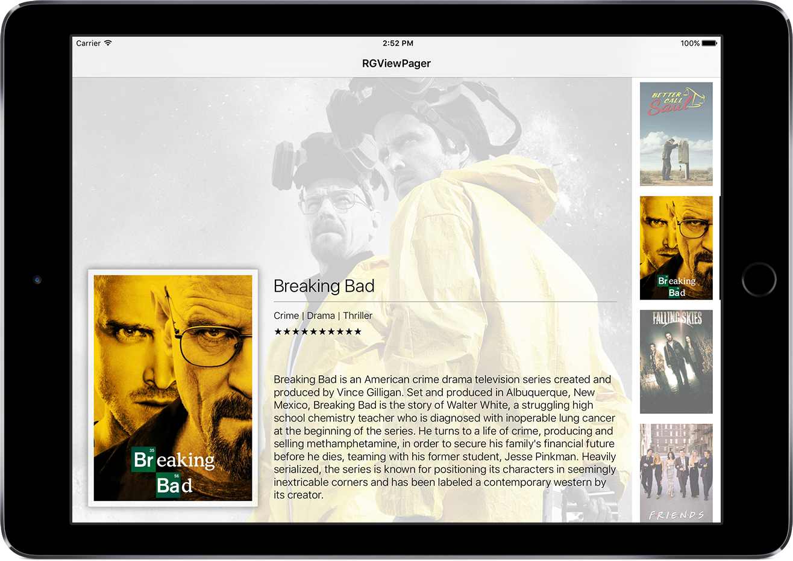
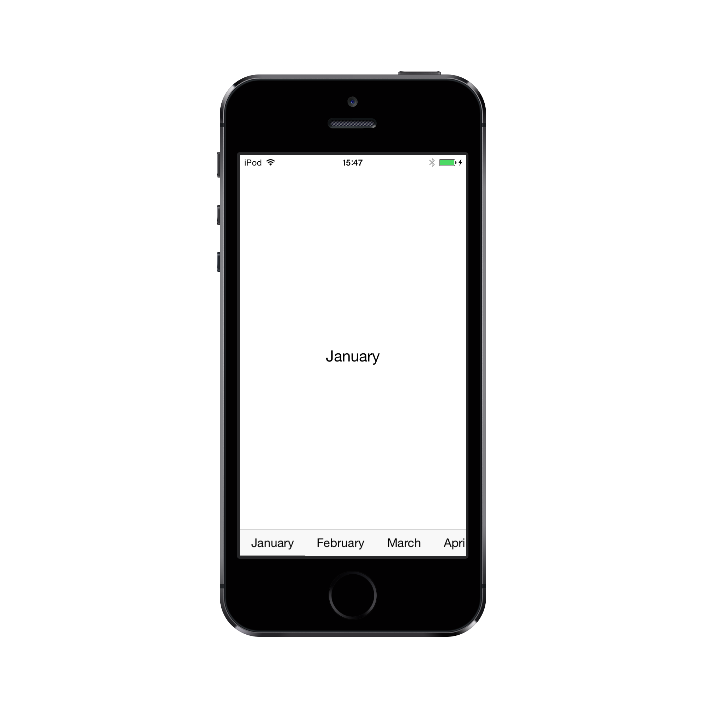

RGPageViewController
===
RGPageViewController is a custom UIPageViewController written in Swift. It is inspired by [ICViewPager](https://github.com/iltercengiz/ICViewPager "ICViewPager") by Ilter Cengiz but with some modifications. It combines an Android-like ViewPager with the blur effect introduced in iOS7. It is fully customizable and can also be used as a replacement for UITabBar.

- [Screenshots](#screenshots)
- [Installation](#installation)
- [Usage](#usage)
	- [RGPageViewControllerDataSource](#rgpageviewcontrollerdatasource)
	- [RGPageViewControllerDelegate](#rgpageviewcontrollerdelegate)
- [Examples](#examples)
	- [Basic Configuration](#basic-configuration)
		- [UITabBar replacement](#uitabbar-replacement)
		- [Additional Options](#additional-options)
			- [UIPageViewControllerNavigationOrientation](#uipageviewcontrollernavigationorientation)
			- [RGTabbarPosition](#rgtabbarposition)
			- [RGTabbarStyle](#rgtabbarstyle)
			- [RGTabStyle](#rgtabstyle)
- [License](#license)

Screenshots
---







Installation
---
Simply copy `RGPageViewController.swift` to your project.

Usage
---
Subclass `RGPageViewController` and implement it's `datasource` and `delegate` methods.

```swift
class MainViewController: RGPageViewController, RGPageViewControllerDataSource, RGPageViewControllerDelegate {
    var tabTitles: NSArray = NSArray()
    
    override func viewDidLoad() {
        super.viewDidLoad()
        
        let dateFormatter = NSDateFormatter()
        tabTitles = dateFormatter.monthSymbols

        self.datasource = self
        self.delegate = self
    }
}
```

### RGPageViewControllerDataSource
```swift
func numberOfPagesForViewController(pageViewController: RGPageViewController) -> Int
```
**Description:**&nbsp;&nbsp;Asks the datasource about the number of pages.  
**Parameters:**&nbsp;&nbsp;`pageViewController`  
&nbsp;&nbsp;&nbsp;&nbsp;&nbsp;&nbsp;&nbsp;&nbsp;&nbsp;&nbsp;&nbsp;&nbsp;&nbsp;&nbsp;&nbsp;&nbsp;&nbsp;&nbsp;&nbsp;&nbsp;&nbsp;&nbsp;&nbsp;the RGPageViewController instance that's subject to.  
**Returns:**&nbsp;&nbsp;&nbsp;&nbsp;&nbsp;&nbsp;&nbsp;&nbsp;the total number of pages.  

```swift
func tabViewForPageAtIndex(pageViewController: RGPageViewController, index: Int) -> UIView
```
**Description:**&nbsp;&nbsp;Asks the datasource to give a view to display as a tab item.  
**Parameters:**&nbsp;&nbsp;`pageViewController`  
&nbsp;&nbsp;&nbsp;&nbsp;&nbsp;&nbsp;&nbsp;&nbsp;&nbsp;&nbsp;&nbsp;&nbsp;&nbsp;&nbsp;&nbsp;&nbsp;&nbsp;&nbsp;&nbsp;&nbsp;&nbsp;&nbsp;&nbsp;the RGPageViewController instance that's subject to.  
&nbsp;&nbsp;&nbsp;&nbsp;&nbsp;&nbsp;&nbsp;&nbsp;&nbsp;&nbsp;&nbsp;&nbsp;&nbsp;&nbsp;&nbsp;&nbsp;&nbsp;&nbsp;&nbsp;&nbsp;&nbsp;&nbsp;&nbsp;`index`  
&nbsp;&nbsp;&nbsp;&nbsp;&nbsp;&nbsp;&nbsp;&nbsp;&nbsp;&nbsp;&nbsp;&nbsp;&nbsp;&nbsp;&nbsp;&nbsp;&nbsp;&nbsp;&nbsp;&nbsp;&nbsp;&nbsp;&nbsp;the index of the tab whose view is asked.  
**Returns:**&nbsp;&nbsp;&nbsp;&nbsp;&nbsp;&nbsp;&nbsp;&nbsp;a UIView instance that will be shown as tab at the given index.  

```swift
func viewControllerForPageAtIndex(pageViewController: RGPageViewController, index: Int) -> UIViewController?
```
**Description:**&nbsp;&nbsp;Asks the datasource to give a ViewController to display as a page.  
**Parameters:**&nbsp;&nbsp;`pageViewController`  
&nbsp;&nbsp;&nbsp;&nbsp;&nbsp;&nbsp;&nbsp;&nbsp;&nbsp;&nbsp;&nbsp;&nbsp;&nbsp;&nbsp;&nbsp;&nbsp;&nbsp;&nbsp;&nbsp;&nbsp;&nbsp;&nbsp;&nbsp;the RGPageViewController instance that's subject to.  
&nbsp;&nbsp;&nbsp;&nbsp;&nbsp;&nbsp;&nbsp;&nbsp;&nbsp;&nbsp;&nbsp;&nbsp;&nbsp;&nbsp;&nbsp;&nbsp;&nbsp;&nbsp;&nbsp;&nbsp;&nbsp;&nbsp;&nbsp;`index`  
&nbsp;&nbsp;&nbsp;&nbsp;&nbsp;&nbsp;&nbsp;&nbsp;&nbsp;&nbsp;&nbsp;&nbsp;&nbsp;&nbsp;&nbsp;&nbsp;&nbsp;&nbsp;&nbsp;&nbsp;&nbsp;&nbsp;&nbsp;the index of the content whose view is asked.  
**Returns:**&nbsp;&nbsp;&nbsp;&nbsp;&nbsp;&nbsp;&nbsp;&nbsp;a UIViewController instance whose view will be shown as content at the given index.  

### RGPageViewControllerDelegate
```swift
optional func willChangePageToIndex(index: Int, fromIndex from: Int)
```
**Description:**&nbsp;&nbsp;Delegate objects can implement this method if they want to be informed when a page  
&nbsp;&nbsp;&nbsp;&nbsp;&nbsp;&nbsp;&nbsp;&nbsp;&nbsp;&nbsp;&nbsp;&nbsp;&nbsp;&nbsp;&nbsp;&nbsp;&nbsp;&nbsp;&nbsp;&nbsp;&nbsp;&nbsp;&nbsp;is about to change.  
**Parameters:**&nbsp;&nbsp;`index`  
&nbsp;&nbsp;&nbsp;&nbsp;&nbsp;&nbsp;&nbsp;&nbsp;&nbsp;&nbsp;&nbsp;&nbsp;&nbsp;&nbsp;&nbsp;&nbsp;&nbsp;&nbsp;&nbsp;&nbsp;&nbsp;&nbsp;&nbsp;the index of the new page.  
&nbsp;&nbsp;&nbsp;&nbsp;&nbsp;&nbsp;&nbsp;&nbsp;&nbsp;&nbsp;&nbsp;&nbsp;&nbsp;&nbsp;&nbsp;&nbsp;&nbsp;&nbsp;&nbsp;&nbsp;&nbsp;&nbsp;`from`  
&nbsp;&nbsp;&nbsp;&nbsp;&nbsp;&nbsp;&nbsp;&nbsp;&nbsp;&nbsp;&nbsp;&nbsp;&nbsp;&nbsp;&nbsp;&nbsp;&nbsp;&nbsp;&nbsp;&nbsp;&nbsp;&nbsp;&nbsp;the index of the old page. 

```swift
optional func didChangePageToIndex(index: Int)
```
**Description:**&nbsp;&nbsp;Delegate objects can implement this method if they want to be informed when a page  
&nbsp;&nbsp;&nbsp;&nbsp;&nbsp;&nbsp;&nbsp;&nbsp;&nbsp;&nbsp;&nbsp;&nbsp;&nbsp;&nbsp;&nbsp;&nbsp;&nbsp;&nbsp;&nbsp;&nbsp;&nbsp;&nbsp;&nbsp;changed.  
**Parameters:**&nbsp;&nbsp;`index`  
&nbsp;&nbsp;&nbsp;&nbsp;&nbsp;&nbsp;&nbsp;&nbsp;&nbsp;&nbsp;&nbsp;&nbsp;&nbsp;&nbsp;&nbsp;&nbsp;&nbsp;&nbsp;&nbsp;&nbsp;&nbsp;&nbsp;&nbsp;the index of the current page. 

```swift
optional func widthForTabAtIndex(index: Int) -> CGFloat
```
**Description:**&nbsp;&nbsp;Delegate objects can implement this method if tabs use dynamic width  
&nbsp;&nbsp;&nbsp;&nbsp;&nbsp;&nbsp;&nbsp;&nbsp;&nbsp;&nbsp;&nbsp;&nbsp;&nbsp;&nbsp;&nbsp;&nbsp;&nbsp;&nbsp;&nbsp;&nbsp;&nbsp;&nbsp;&nbsp;or to overwrite the default width for tabs.  
**Parameters:**&nbsp;&nbsp;`index`  
&nbsp;&nbsp;&nbsp;&nbsp;&nbsp;&nbsp;&nbsp;&nbsp;&nbsp;&nbsp;&nbsp;&nbsp;&nbsp;&nbsp;&nbsp;&nbsp;&nbsp;&nbsp;&nbsp;&nbsp;&nbsp;&nbsp;&nbsp;the index of the tab.  
**Returns:**&nbsp;&nbsp;&nbsp;&nbsp;&nbsp;&nbsp;&nbsp;&nbsp;the width for the tab at the given index.  

```swift
optional func heightForTabAtIndex(index: Int) -> CGFloat
```
**Description:**&nbsp;&nbsp;Delegate objects can implement this method if tabs use dynamic height  
&nbsp;&nbsp;&nbsp;&nbsp;&nbsp;&nbsp;&nbsp;&nbsp;&nbsp;&nbsp;&nbsp;&nbsp;&nbsp;&nbsp;&nbsp;&nbsp;&nbsp;&nbsp;&nbsp;&nbsp;&nbsp;&nbsp;&nbsp;or to overwrite the default height for tabs.  
**Parameters:**&nbsp;&nbsp;`index`  
&nbsp;&nbsp;&nbsp;&nbsp;&nbsp;&nbsp;&nbsp;&nbsp;&nbsp;&nbsp;&nbsp;&nbsp;&nbsp;&nbsp;&nbsp;&nbsp;&nbsp;&nbsp;&nbsp;&nbsp;&nbsp;&nbsp;&nbsp;the index of the tab.  
**Returns:**&nbsp;&nbsp;&nbsp;&nbsp;&nbsp;&nbsp;&nbsp;&nbsp;the height for the tab at the given index.  

Examples
---

All `RGPageViewControllerDataSource` protocol methods must be implemented. All `RGPageViewControllerDelegate` protocol methods are optional.

### Basic Configuration
```swift
// MARK: - RGPageViewController Data Source
func numberOfPagesForViewController(pageViewController: RGPageViewController) -> Int {
    // return the total number of pages
    return self.tabTitles.count
}
    
func tabViewForPageAtIndex(pageViewController: RGPageViewController, index: Int) -> UIView {
    // return a simple label for the tab view
    let title: String = self.tabTitles.objectAtIndex(index) as String
    let label: UILabel = UILabel()
    
    label.text = title
    
    label.sizeToFit()
        
    return label
}
    
func viewControllerForPageAtIndex(pageViewController: RGPageViewController, index: Int) -> UIViewController? {
    // Create a new view controller and pass suitable data.
    let dataViewController = self.storyboard!.instantiateViewControllerWithIdentifier("DataViewController") as DataViewController
        
    dataViewController.dataObject = self.tabTitles[index]
        
    return dataViewController
}
```
#### UITabBar replacement

If you need something similar to a `UITabBar` but with the features of a `UIPageViewController`, change your `tabViewForPageAtIndex(pageViewController: RGPageViewController, index: Int)` and implement `heightForTabbar()` and override the default position `RGTabbarPosition.Top`.

```swift
// MARK: - RGTabbarPosition
override var tabbarPosition: RGTabbarPosition {
    get {
        return .Bottom
    }
}

// MARK: - TabbarHeight
override var tabbarHeight: CGFloat {
    get {
        return 49
    }
}

// MARK: - RGPageViewController Data Source
func tabViewForPageAtIndex(pageViewController: RGPageViewController, index: Int) -> UIView {
    let title: String = self.tabTitles.objectAtIndex(index) as String
    // create a RGTabBarItem and pass a title, an image and a color
    // the color will be used for tinting image and text
    let tabView: RGTabBarItem = RGTabBarItem(frame: CGRectMake(0.0, 0.0, self.view.bounds.width / 6.0, 49.0), text: title, image: UIImage(named: "Grid"), color: nil)
    
    // if you want to adjust the color for selected state of the item, adjust the tintColor
    tabView.tintColor = UIColor.redColor()
        
    return tabView
}
```
#### Additional Options
##### UIPageViewControllerNavigationOrientation
Change the default orientation of the pageView by overriding `pagerOrientation`.    
**Default:**&nbsp;&nbsp;&nbsp;UIPageViewControllerNavigationOrientation.Horizontal    
**Options:**&nbsp;&nbsp;Horizontal | Vertical
```swift
// MARK: - UIPageViewControllerNavigationOrientation
override var pagerOrientation: UIPageViewControllerNavigationOrientation {
    get {
        return .Vertical
    }
}
```
##### RGTabbarPosition
Change the default position of the Tabbar by overriding `tabbarPosition`.    
**Default:**&nbsp;&nbsp;&nbsp;RGTabbarPosition.Top    
**Options:**&nbsp;&nbsp;Top | Bottom | Left | Right
```swift
// MARK: - RGTabbarPosition
override var tabbarPosition: RGTabbarPosition {
    get {
        return .Left
    }
}
```
##### RGTabbarStyle
Change the default style of the Tabbar by overriding `tabbarStyle`.    
**Default:**&nbsp;&nbsp;&nbsp;RGTabbarStyle.Blurred    
**Options:**&nbsp;&nbsp;Blurred | Solid
```swift
// MARK: - RGTabbarStyle
override var tabbarStyle: RGTabbarStyle {
    get {
        return .Solid
    }
}
```
##### RGTabStyle
Change the default style of the Tabs by overriding `tabStyle`.    
**Default:**&nbsp;&nbsp;&nbsp;RGTabStyle.None    
**Options:**&nbsp;&nbsp;None | InactiveFaded
```swift
// MARK: - RGTabStyle
override var tabStyle: RGTabStyle {
    get {
        return .InactiveFaded
    }
}
```


License
---
The MIT License (MIT)

Copyright (c) 2014 Ronny Gerasch

Permission is hereby granted, free of charge, to any person obtaining a copy
of this software and associated documentation files (the "Software"), to deal
in the Software without restriction, including without limitation the rights
to use, copy, modify, merge, publish, distribute, sublicense, and/or sell
copies of the Software, and to permit persons to whom the Software is
furnished to do so, subject to the following conditions:

The above copyright notice and this permission notice shall be included in all
copies or substantial portions of the Software.

THE SOFTWARE IS PROVIDED "AS IS", WITHOUT WARRANTY OF ANY KIND, EXPRESS OR
IMPLIED, INCLUDING BUT NOT LIMITED TO THE WARRANTIES OF MERCHANTABILITY,
FITNESS FOR A PARTICULAR PURPOSE AND NONINFRINGEMENT. IN NO EVENT SHALL THE
AUTHORS OR COPYRIGHT HOLDERS BE LIABLE FOR ANY CLAIM, DAMAGES OR OTHER
LIABILITY, WHETHER IN AN ACTION OF CONTRACT, TORT OR OTHERWISE, ARISING FROM,
OUT OF OR IN CONNECTION WITH THE SOFTWARE OR THE USE OR OTHER DEALINGS IN THE
SOFTWARE.

