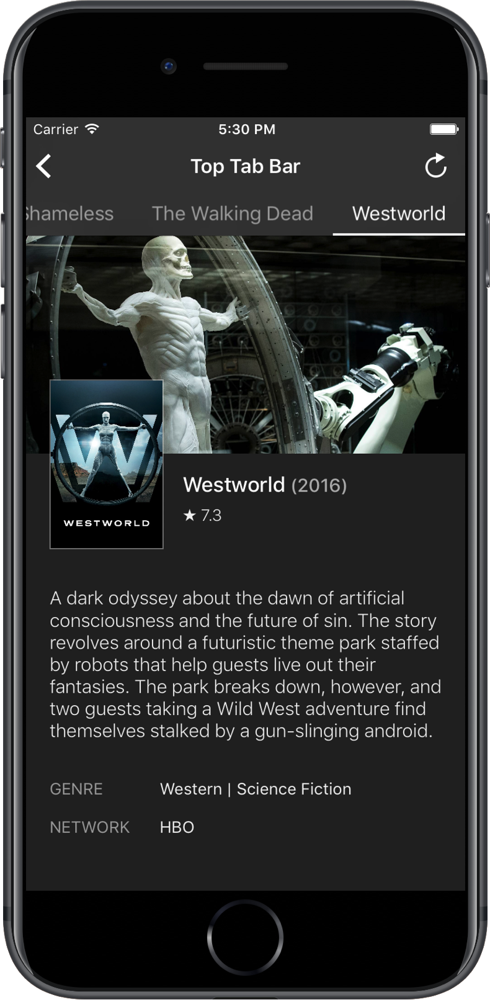
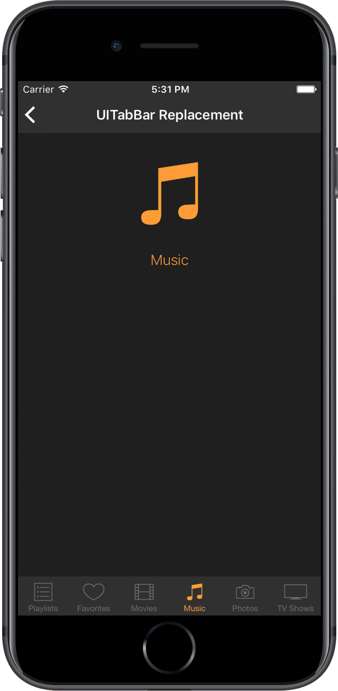

# RGPageViewController

RGPageViewController is a custom UIPageViewController written in Swift. It is inspired by [ICViewPager](https://github.com/iltercengiz/ICViewPager "ICViewPager") by Ilter Cengiz but with some modifications. It combines an Android-like ViewPager with the blur effect introduced in iOS7. It is fully customizable and can also be used as a replacement for UITabBar.

- [Screenshots](#screenshots)
- [Installation](#installation)
- [Usage](#usage)
	- [RGPageViewControllerDataSource](#rgpageviewcontrollerdatasource)
	- [RGPageViewControllerDelegate](#rgpageviewcontrollerdelegate)
- [Examples](#examples)
	- [Basic Configuration](#basic-configuration)
		- [UITabBar replacement](#uitabbar-replacement)
		- [Additional Options](#additional-options)
			- [UIPageViewControllerNavigationOrientation](#uipageviewcontrollernavigationorientation)
			- [RGTabbarPosition](#rgtabbarposition)
			- [RGTabbarStyle](#rgtabbarstyle)
			- [RGTabStyle](#rgtabstyle)
- [License](#license)

## Screenshots







## Installation
### Requirements
- Xcode 8
- [CocoaPods](https://cocoapods.org)

### CocoaPods

```ruby
pod 'RGPageViewController'
```

Built this way, you should add
```swift
import RGPageViewController
```
to your Swift code.

### Installing Manually

The version available through CocoaPods is written in Swift 3. However, if you still use an older version of Swift, just import [`RGPageViewController.swift`](https://github.com/eRGoon/RGPageViewController/blob/master/RGPageViewController.swift) into your project. Ther is also a version for for Swift 3, if you prefer not to use CocoaPods [`RGPageViewController3.swift`](https://github.com/eRGoon/RGPageViewController/blob/master/RGPageViewController3.swift). These versions are deprecated and will not get any future updates.

## Usage

Subclass `RGPageViewController` and implement it's `datasource` and `delegate` methods.

```swift
class MainViewController: RGPageViewController, RGPageViewControllerDataSource, RGPageViewControllerDelegate {
    var tabTitles: NSArray = NSArray()
    
    override func viewDidLoad() {
        super.viewDidLoad()
        
        let dateFormatter = NSDateFormatter()
        tabTitles = dateFormatter.monthSymbols

        self.datasource = self
        self.delegate = self
    }
}
```

### RGPageViewControllerDataSource
```swift
func numberOfPages(for pageViewController: RGPageViewController) -> Int
```
**Description:**&nbsp;&nbsp;Asks the datasource about the number of pages.  
**Parameters:**&nbsp;&nbsp;`pageViewController`  
&nbsp;&nbsp;&nbsp;&nbsp;&nbsp;&nbsp;&nbsp;&nbsp;&nbsp;&nbsp;&nbsp;&nbsp;&nbsp;&nbsp;&nbsp;&nbsp;&nbsp;&nbsp;&nbsp;&nbsp;&nbsp;&nbsp;&nbsp;the `RGPageViewController` instance.  
**Returns:**&nbsp;&nbsp;&nbsp;&nbsp;&nbsp;&nbsp;&nbsp;&nbsp;the total number of pages.  

```swift
func pageViewController(_ pageViewController: RGPageViewController, tabViewForPageAt index: Int) -> UIView
```
**Description:**&nbsp;&nbsp;Asks the datasource to give a view to display as a tab item.  
**Parameters:**&nbsp;&nbsp;`pageViewController`  
&nbsp;&nbsp;&nbsp;&nbsp;&nbsp;&nbsp;&nbsp;&nbsp;&nbsp;&nbsp;&nbsp;&nbsp;&nbsp;&nbsp;&nbsp;&nbsp;&nbsp;&nbsp;&nbsp;&nbsp;&nbsp;&nbsp;&nbsp;the `RGPageViewController` instance.  
&nbsp;&nbsp;&nbsp;&nbsp;&nbsp;&nbsp;&nbsp;&nbsp;&nbsp;&nbsp;&nbsp;&nbsp;&nbsp;&nbsp;&nbsp;&nbsp;&nbsp;&nbsp;&nbsp;&nbsp;&nbsp;&nbsp;&nbsp;`index`  
&nbsp;&nbsp;&nbsp;&nbsp;&nbsp;&nbsp;&nbsp;&nbsp;&nbsp;&nbsp;&nbsp;&nbsp;&nbsp;&nbsp;&nbsp;&nbsp;&nbsp;&nbsp;&nbsp;&nbsp;&nbsp;&nbsp;&nbsp;the index of the tab whose view is asked.  
**Returns:**&nbsp;&nbsp;&nbsp;&nbsp;&nbsp;&nbsp;&nbsp;&nbsp;a `UIView` instance that will be shown as tab at the given index.  

```swift
func pageViewController(_ pageViewController: RGPageViewController, viewControllerForPageAt index: Int) -> UIViewController?
```
**Description:**&nbsp;&nbsp;Asks the datasource to give a ViewController to display as a page.  
**Parameters:**&nbsp;&nbsp;`pageViewController`  
&nbsp;&nbsp;&nbsp;&nbsp;&nbsp;&nbsp;&nbsp;&nbsp;&nbsp;&nbsp;&nbsp;&nbsp;&nbsp;&nbsp;&nbsp;&nbsp;&nbsp;&nbsp;&nbsp;&nbsp;&nbsp;&nbsp;&nbsp;the `RGPageViewController` instance.  
&nbsp;&nbsp;&nbsp;&nbsp;&nbsp;&nbsp;&nbsp;&nbsp;&nbsp;&nbsp;&nbsp;&nbsp;&nbsp;&nbsp;&nbsp;&nbsp;&nbsp;&nbsp;&nbsp;&nbsp;&nbsp;&nbsp;&nbsp;`index`  
&nbsp;&nbsp;&nbsp;&nbsp;&nbsp;&nbsp;&nbsp;&nbsp;&nbsp;&nbsp;&nbsp;&nbsp;&nbsp;&nbsp;&nbsp;&nbsp;&nbsp;&nbsp;&nbsp;&nbsp;&nbsp;&nbsp;&nbsp;the index of the content whose ViewController is asked.  
**Returns:**&nbsp;&nbsp;&nbsp;&nbsp;&nbsp;&nbsp;&nbsp;&nbsp;a `UIViewController` instance whose view will be shown as content at the given index.  

### RGPageViewControllerDelegate
```swift
optional func pageViewController(_ pageViewController: RGPageViewController, willChangePageTo index: Int, fromIndex from: Int)
```
**Description:**&nbsp;&nbsp;Delegate objects can implement this method if they want to be informed when a page  
&nbsp;&nbsp;&nbsp;&nbsp;&nbsp;&nbsp;&nbsp;&nbsp;&nbsp;&nbsp;&nbsp;&nbsp;&nbsp;&nbsp;&nbsp;&nbsp;&nbsp;&nbsp;&nbsp;&nbsp;&nbsp;&nbsp;&nbsp;is about to become visible.  
**Parameters:**&nbsp;&nbsp;`pageViewController`  
&nbsp;&nbsp;&nbsp;&nbsp;&nbsp;&nbsp;&nbsp;&nbsp;&nbsp;&nbsp;&nbsp;&nbsp;&nbsp;&nbsp;&nbsp;&nbsp;&nbsp;&nbsp;&nbsp;&nbsp;&nbsp;&nbsp;&nbsp;the `RGPageViewController` instance.  
&nbsp;&nbsp;&nbsp;&nbsp;&nbsp;&nbsp;&nbsp;&nbsp;&nbsp;&nbsp;&nbsp;&nbsp;&nbsp;&nbsp;&nbsp;&nbsp;&nbsp;&nbsp;&nbsp;&nbsp;&nbsp;&nbsp;&nbsp;`index`  
&nbsp;&nbsp;&nbsp;&nbsp;&nbsp;&nbsp;&nbsp;&nbsp;&nbsp;&nbsp;&nbsp;&nbsp;&nbsp;&nbsp;&nbsp;&nbsp;&nbsp;&nbsp;&nbsp;&nbsp;&nbsp;&nbsp;&nbsp;the index of the next page.  
&nbsp;&nbsp;&nbsp;&nbsp;&nbsp;&nbsp;&nbsp;&nbsp;&nbsp;&nbsp;&nbsp;&nbsp;&nbsp;&nbsp;&nbsp;&nbsp;&nbsp;&nbsp;&nbsp;&nbsp;&nbsp;&nbsp;`fromIndex`  
&nbsp;&nbsp;&nbsp;&nbsp;&nbsp;&nbsp;&nbsp;&nbsp;&nbsp;&nbsp;&nbsp;&nbsp;&nbsp;&nbsp;&nbsp;&nbsp;&nbsp;&nbsp;&nbsp;&nbsp;&nbsp;&nbsp;&nbsp;the index of the current page. 

```swift
optional func pageViewController(_ pageViewController: RGPageViewController, didChangePageTo index: Int)
```
**Description:**&nbsp;&nbsp;Delegate objects can implement this method if they want to be informed when a page  
&nbsp;&nbsp;&nbsp;&nbsp;&nbsp;&nbsp;&nbsp;&nbsp;&nbsp;&nbsp;&nbsp;&nbsp;&nbsp;&nbsp;&nbsp;&nbsp;&nbsp;&nbsp;&nbsp;&nbsp;&nbsp;&nbsp;&nbsp;became visible.  
**Parameters:**&nbsp;&nbsp;`pageViewController`  
&nbsp;&nbsp;&nbsp;&nbsp;&nbsp;&nbsp;&nbsp;&nbsp;&nbsp;&nbsp;&nbsp;&nbsp;&nbsp;&nbsp;&nbsp;&nbsp;&nbsp;&nbsp;&nbsp;&nbsp;&nbsp;&nbsp;&nbsp;the `RGPageViewController` instance.  
&nbsp;&nbsp;&nbsp;&nbsp;&nbsp;&nbsp;&nbsp;&nbsp;&nbsp;&nbsp;&nbsp;&nbsp;&nbsp;&nbsp;&nbsp;&nbsp;&nbsp;&nbsp;&nbsp;&nbsp;&nbsp;&nbsp;&nbsp;`index`  
&nbsp;&nbsp;&nbsp;&nbsp;&nbsp;&nbsp;&nbsp;&nbsp;&nbsp;&nbsp;&nbsp;&nbsp;&nbsp;&nbsp;&nbsp;&nbsp;&nbsp;&nbsp;&nbsp;&nbsp;&nbsp;&nbsp;&nbsp;the index of the current page. 

```swift
optional func pageViewController(_ pageViewController: RGPageViewController, widthForTabAt index: Int) -> CGFloat
```
**Description:**&nbsp;&nbsp;Delegate objects can implement this method if tabs use dynamic width  
&nbsp;&nbsp;&nbsp;&nbsp;&nbsp;&nbsp;&nbsp;&nbsp;&nbsp;&nbsp;&nbsp;&nbsp;&nbsp;&nbsp;&nbsp;&nbsp;&nbsp;&nbsp;&nbsp;&nbsp;&nbsp;&nbsp;&nbsp;or to overwrite the default width for tabs.  
**Parameters:**&nbsp;&nbsp;`pageViewController`  
&nbsp;&nbsp;&nbsp;&nbsp;&nbsp;&nbsp;&nbsp;&nbsp;&nbsp;&nbsp;&nbsp;&nbsp;&nbsp;&nbsp;&nbsp;&nbsp;&nbsp;&nbsp;&nbsp;&nbsp;&nbsp;&nbsp;&nbsp;the `RGPageViewController` instance.  
&nbsp;&nbsp;&nbsp;&nbsp;&nbsp;&nbsp;&nbsp;&nbsp;&nbsp;&nbsp;&nbsp;&nbsp;&nbsp;&nbsp;&nbsp;&nbsp;&nbsp;&nbsp;&nbsp;&nbsp;&nbsp;&nbsp;&nbsp;`index`  
&nbsp;&nbsp;&nbsp;&nbsp;&nbsp;&nbsp;&nbsp;&nbsp;&nbsp;&nbsp;&nbsp;&nbsp;&nbsp;&nbsp;&nbsp;&nbsp;&nbsp;&nbsp;&nbsp;&nbsp;&nbsp;&nbsp;&nbsp;the index of the tab.  
**Returns:**&nbsp;&nbsp;&nbsp;&nbsp;&nbsp;&nbsp;&nbsp;&nbsp;the width for the tab at the given index.  

```swift
optional func pageViewController(_ pageViewController: RGPageViewController, heightForTabAt index: Int) -> CGFloat
```
**Description:**&nbsp;&nbsp;Delegate objects can implement this method if tabs use dynamic height  
&nbsp;&nbsp;&nbsp;&nbsp;&nbsp;&nbsp;&nbsp;&nbsp;&nbsp;&nbsp;&nbsp;&nbsp;&nbsp;&nbsp;&nbsp;&nbsp;&nbsp;&nbsp;&nbsp;&nbsp;&nbsp;&nbsp;&nbsp;or to overwrite the default height for tabs.  
**Parameters:**&nbsp;&nbsp;`pageViewController`  
&nbsp;&nbsp;&nbsp;&nbsp;&nbsp;&nbsp;&nbsp;&nbsp;&nbsp;&nbsp;&nbsp;&nbsp;&nbsp;&nbsp;&nbsp;&nbsp;&nbsp;&nbsp;&nbsp;&nbsp;&nbsp;&nbsp;&nbsp;the `RGPageViewController` instance.  
&nbsp;&nbsp;&nbsp;&nbsp;&nbsp;&nbsp;&nbsp;&nbsp;&nbsp;&nbsp;&nbsp;&nbsp;&nbsp;&nbsp;&nbsp;&nbsp;&nbsp;&nbsp;&nbsp;&nbsp;&nbsp;&nbsp;&nbsp;`index`  
&nbsp;&nbsp;&nbsp;&nbsp;&nbsp;&nbsp;&nbsp;&nbsp;&nbsp;&nbsp;&nbsp;&nbsp;&nbsp;&nbsp;&nbsp;&nbsp;&nbsp;&nbsp;&nbsp;&nbsp;&nbsp;&nbsp;&nbsp;the index of the tab.  
**Returns:**&nbsp;&nbsp;&nbsp;&nbsp;&nbsp;&nbsp;&nbsp;&nbsp;the height for the tab at the given index.  

## Examples

All `RGPageViewControllerDataSource` methods must be implemented. All `RGPageViewControllerDelegate` methods are optional.

### Basic Configuration
```swift
// MARK: - RGPageViewController Data Source
func numberOfPages(for pageViewController: RGPageViewController) -> Int {
    // return the total number of pages
    return self.tabTitles.count
}
    
func pageViewController(_ pageViewController: RGPageViewController, tabViewForPageAt index: Int) -> UIView {
    // return a simple label for the tab view
    let title: String = self.tabTitles.objectAtIndex(index) as String
    let label: UILabel = UILabel()
    
    label.text = title
    
    label.sizeToFit()
        
    return label
}
    
func pageViewController(_ pageViewController: RGPageViewController, viewControllerForPageAt index: Int) -> UIViewController? {
    // Create a new view controller and pass suitable data.
    let dataViewController = self.storyboard!.instantiateViewControllerWithIdentifier("DataViewController") as DataViewController
        
    dataViewController.dataObject = self.tabTitles[index]
        
    return dataViewController
}
```
### UITabBar replacement

If you need something similar to a `UITabBar` but with the features of a `UIPageViewController`, change your `pageViewController(_ pageViewController: RGPageViewController, tabViewForPageAt index: Int) -> UIView` and implement `pageViewController(_ pageViewController: RGPageViewController, heightForTabAt index: Int) -> CGFloat` and override the default position `RGTabbarPosition.Top`.

```swift
// MARK: - RGTabbarPosition
override var tabbarPosition: RGTabbarPosition {
    return .bottom
}

// MARK: - TabbarHeight
override var tabbarHeight: CGFloat {
    return 49
}

// MARK: - RGPageViewController Data Source
func pageViewController(_ pageViewController: RGPageViewController, tabViewForPageAt index: Int) -> UIView {
    let title: String = self.tabTitles.objectAtIndex(index) as String
    // create a RGTabBarItem and pass a title, an image and a color
    // the color will be used for tinting image and text
    let tabView: RGTabBarItem = RGTabBarItem(frame: CGRect(x: 0, y: 0, width: view.bounds.width / 6, height: 49), text: title, image: UIImage(named: "your_image"), color: nil)
    
    // if you want to adjust the color for selected state of the item, adjust the tintColor
    tabView.tintColor = UIColor.redColor()
        
    return tabView
}
```
## Additional Options
### UIPageViewControllerNavigationOrientation
Change the default orientation of the pageView.    
**Default:**&nbsp;&nbsp;&nbsp;`UIPageViewControllerNavigationOrientation.horizontal`    
**Options:**&nbsp;&nbsp;`horizontal` | `vertical`
```swift
// MARK: - UIPageViewControllerNavigationOrientation
override var pagerOrientation: UIPageViewControllerNavigationOrientation {
    return .vertical
}
```
### RGTabbarPosition
Change the default position of the Tabbar.    
**Default:**&nbsp;&nbsp;&nbsp;`RGTabbarPosition.top`    
**Options:**&nbsp;&nbsp;`top` | `bottom` | `left` | `right`
```swift
// MARK: - RGTabbarPosition
override var tabbarPosition: RGTabbarPosition {
    return .left
}
```
### RGTabbarStyle
Change the default style of the Tabbar.    
**Default:**&nbsp;&nbsp;&nbsp;`RGTabbarStyle.blurred`    
**Options:**&nbsp;&nbsp;`blurred` | `solid`
```swift
// MARK: - RGTabbarStyle
override var tabbarStyle: RGTabbarStyle {
    return .solid
}
```
### RGTabStyle
Change the default style of the Tabs.    
**Default:**&nbsp;&nbsp;&nbsp;`RGTabStyle.none`    
**Options:**&nbsp;&nbsp;`none` | `inactiveFaded`
```swift
// MARK: - RGTabStyle
override var tabStyle: RGTabStyle {
    return .inactiveFaded
}
```
### tabWidth
Change the default width for all tabs.    
**Default:**&nbsp;&nbsp;&nbsp;`UIScreen.main.bounds.size.width / 3`    
```swift
override var tabWidth: CGFloat {
    return UIScreen.main.bounds.size.width / 6
}
```
### tabbarWidth
Change the default width for the tabbar.    
This is only applied for vertical tabbars.    
**Default:**&nbsp;&nbsp;&nbsp;`100`
```swift
override var tabbarWidth: CGFloat {
    return 140
}
```
### tabbarHeight
Change the default height for the tabbar.    
This is only applied for horizontal tabbars.    
**Default:**&nbsp;&nbsp;&nbsp;`38`
```swift
override var tabbarHeight: CGFloat {
    return 49
}
```
### tabIndicatorWidthOrHeight
Change the width or height of the tab indicator.    
**Default:**&nbsp;&nbsp;&nbsp;`2`
```swift
override var tabIndicatorWidthOrHeight: CGFloat {
    return 0
}
```
### barTintColor
Change the tint color of the tabbar.    
**Default:**&nbsp;&nbsp;&nbsp;`nil`
```swift
override var barTintColor: UIColor {
    return navigationController?.navigationBar.barTintColor
}
```
### tabIndicatorColor
Change the color of the tab indicator.    
**Default:**&nbsp;&nbsp;&nbsp;`UIColor.lightGray`
```swift
override var tabIndicatorColor: UIColor {
    return UIColor.white
}
```
### tabMargin
Add additional margin between each tab.    
This also applies half of the amount as additional margin before the first amd after the last tab.    
**Default:**&nbsp;&nbsp;&nbsp;`0`
```swift
override var tabMargin: CGFloat {
    return 16
}
```
### tabbarHidden
Hide the tabbar completely.    
**Default:**&nbsp;&nbsp;&nbsp;`false`
```swift
override var tabbarHidden: Bool {
    return true
}
```


## License

The MIT License (MIT)

Copyright (c) 2014 Ronny Gerasch

Permission is hereby granted, free of charge, to any person obtaining a copy
of this software and associated documentation files (the "Software"), to deal
in the Software without restriction, including without limitation the rights
to use, copy, modify, merge, publish, distribute, sublicense, and/or sell
copies of the Software, and to permit persons to whom the Software is
furnished to do so, subject to the following conditions:

The above copyright notice and this permission notice shall be included in all
copies or substantial portions of the Software.

THE SOFTWARE IS PROVIDED "AS IS", WITHOUT WARRANTY OF ANY KIND, EXPRESS OR
IMPLIED, INCLUDING BUT NOT LIMITED TO THE WARRANTIES OF MERCHANTABILITY,
FITNESS FOR A PARTICULAR PURPOSE AND NONINFRINGEMENT. IN NO EVENT SHALL THE
AUTHORS OR COPYRIGHT HOLDERS BE LIABLE FOR ANY CLAIM, DAMAGES OR OTHER
LIABILITY, WHETHER IN AN ACTION OF CONTRACT, TORT OR OTHERWISE, ARISING FROM,
OUT OF OR IN CONNECTION WITH THE SOFTWARE OR THE USE OR OTHER DEALINGS IN THE
SOFTWARE.

